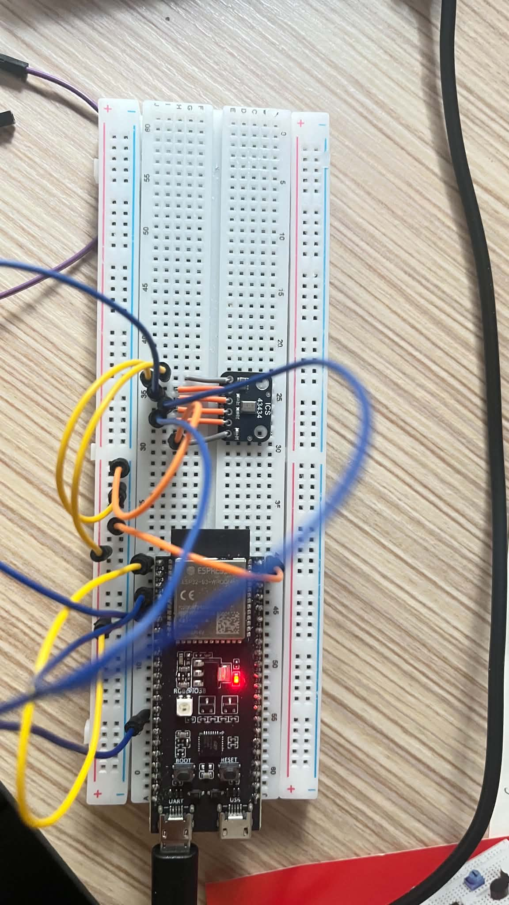
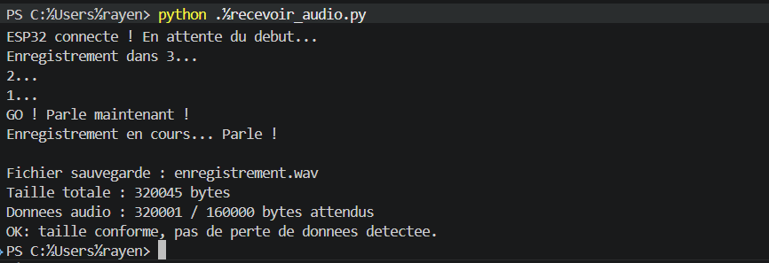

# ESP32-S3 + Micro I2S ICS43434 — Enregistrement audio

Test et enregistrement audio avec un micro numérique I2S ICS43434 sur ESP32-S3, via le driver I2S natif du core Espressif (`driver/i2s_std.h`), sans librairie externe à installer.

## Matériel

- ESP32-S3
- Micro I2S ICS43434 (MEMS numérique)
- Breadboard + fils de câblage
- Condensateur céramique 100nF (16V ou plus), pour le découplage de l'alimentation

## Branchement

| ICS43434 | ESP32-S3 | Rôle |
|---|---|---|
| 3V (VDD) | 3.3V | Alimentation |
| GND | GND | Masse |
| BCLK | GPIO 5 | Horloge bit (bit clock) |
| DOUT | GPIO 4 | Données audio (sortie micro → entrée ESP32) |
| LRCL (WS) | GPIO 9 | Sélection de canal (word select) |
| SEL | GND | Sélection du canal gauche |

Le condensateur 100nF est placé entre VDD et GND, directement sur les pattes d'alimentation du micro, pour filtrer le bruit numérique.

## Fichiers

- **`enregistrement_audio.ino`** — Sketch Arduino IDE. Au démarrage : compte à rebours de 3 secondes, puis enregistre 5 secondes d'audio et les envoie en streaming au format WAV sur le port série (921600 bauds).
- **`recevoir_audio.py`** — Script Python (PC). Écoute le port série, reçoit le flux WAV envoyé par l'ESP32 et le sauvegarde en fichier `.wav`. Vérifie aussi qu'aucune donnée n'a été perdue pendant la transmission.

## Prérequis

- Arduino IDE avec le core ESP32 (Espressif) installé
- Python 3 avec `pyserial` : `pip install pyserial`

## Utilisation

1. Ouvrir `enregistrement_audio.ino` dans Arduino IDE, vérifier les pins si le câblage diffère, uploader sur l'ESP32-S3
2. **Fermer le moniteur série** dans Arduino IDE (le port doit être libre pour Python)
3. Dans `recevoir_audio.py`, vérifier/adapter le port COM (`PORT = "COM8"`)
4. Lancer `python recevoir_audio.py` — il affiche "En attente de l'ESP32..." et attend
5. Appuyer sur le bouton **RESET** de l'ESP32
6. Parler quand "GO !" apparaît
7. Le fichier `enregistrement.wav` est sauvegardé dans le dossier où le script a été lancé

## Notes techniques

- Le flux I2S est capté en 32 bits (24 bits utiles côté micro), puis réduit à du PCM 16 bits mono avant l'envoi.
- Le taux déclaré dans l'entête WAV peut différer du taux demandé au périphérique I2S : en mode mono, l'ESP32 peut produire le flux à un débit différent de celui configuré. Si l'audio semble accéléré ou ralenti à la lecture, ajuster `WAV_SAMPLE_RATE` dans le sketch en conséquence.
- Un multimètre en mode tension DC permet de vérifier qu'une horloge (BCLK/WS) fonctionne réellement sur une pin : une valeur autour de la moitié du rail (~1.6V pour un signal 3.3V) indique un signal qui bascule normalement ; 0V ou 3.3V pile indique une pin bloquée.
